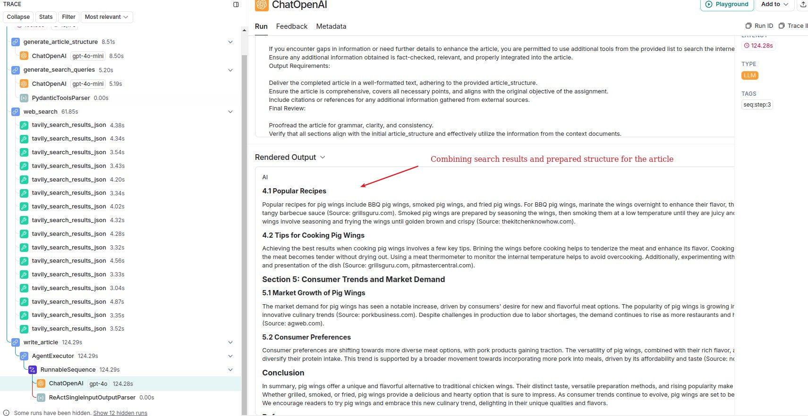

## Description

This is a simple pet project to demonstrate how LangGraph works with a combinations of different tools.  
First it takes user input (it can be a simple description of the task or a detailed instruction with the structure of the article).    
Then it prepares a structure of the article and uses AI to generate a list of questions to search in the internet to gather information.  
After that it takes search results and applies them to the structure of the article.  
Finally, it generates a text of the article.

  
___
  
___
  
___
  
___
  
___

## How to install

Run the following command to install the project in console:

1) Clone the repository: `git clone git@github.com:sasha370/ai_writer.git`
2) Change to the project directory: `cd ai_writer`
3) Install package dependencies:
    ```sh
        # install plugin for python version management (if you don't have it)
        curl -sSL https://install.python-poetry.org | python3 -    
   
        # install dependencies
        poetry install
    ```
4) Copy the `.env.example` file to `.env` and fill in the missing values:
    ```sh
        cp .env.example .env
    ```

## How to run

You can input the text in the console or use the `task.txt` file.  
**Be aware that AI ignores most markup formatting so you don't need to clean up or prepare your text.**


Run the following command to run the project in console:

```sh
    poetry run python main.py
```
